# Exercise 2: Create a Shopping Cart Business Object
<!-- description --> Create a shopping cart business object with SAP S/4HANA Cloud, ABAP Environment or SAP S/4HANA on-premise.

## Introduction
Now that you have implemented a custom wrapper for the non-released SAP API `BAPI_PR_CREATE` for the creation of purchase requisition and released it for the ABAP Cloud development in [exercise 1](../ex1/README.md), you will now create your _Shopping Cart_ RAP business object and a UI service on top it.


- [You will learn](#you-will-learn)
- [Summary & Next Exercise](#summary--next-exercise) 


## You will learn  
- How to create an ABAP package on tier 1 (superpackage: `ZLOCAL`),
- How to create a database table
- How to generate a transactional UI service
- How to enhance the behavior definition of a data model 
- How to publish a service binding
- How to run the SAP Fiori Elements Preview
 
> **Reminder:**   
> Don't forget to replace all occurences of the placeholder **`###`** with your assigned group number in the exercise steps below.  
> You can use the ADT function **Replace All** (**Ctrl+F**) for the purpose.   
> If you don't have a group number, choose a 3-digit suffix and use it for all exercises.


## Step 1: Create ABAP package

**Hint:** In case the CAL instance is not used, please set up for developer extensibility to get `ZLOCAL` package.
 - Create software component for local cloud-ready development with `ZLOCAL`
 - Create a structure package with `ZLOCAL`

<details>
  <summary>🔵 Click to expand</summary>
  
  1.  Select **ZLOCAL** > **New** > **ABAP Package**.

      <!-- 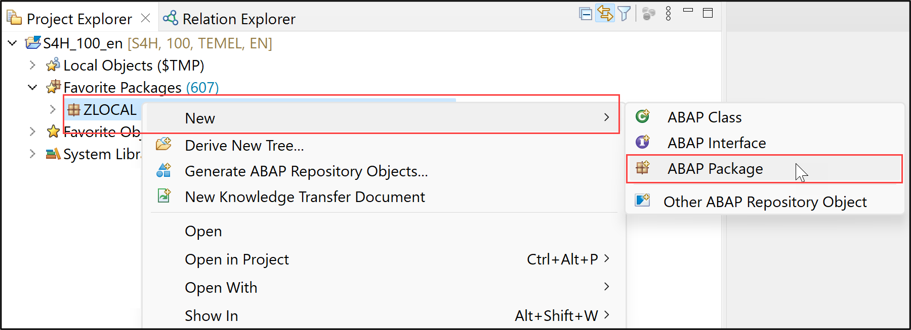 -->
      

  2.  Create new **ABAP package**:
       - Name: **`Z_PURCHASE_REQ_###`**
       - Description: Package ###
       - Check **Add to favorite packages**

      <!--  -->
      

       Click **Next >**.

  3. Click **Next >**.

      <!-- 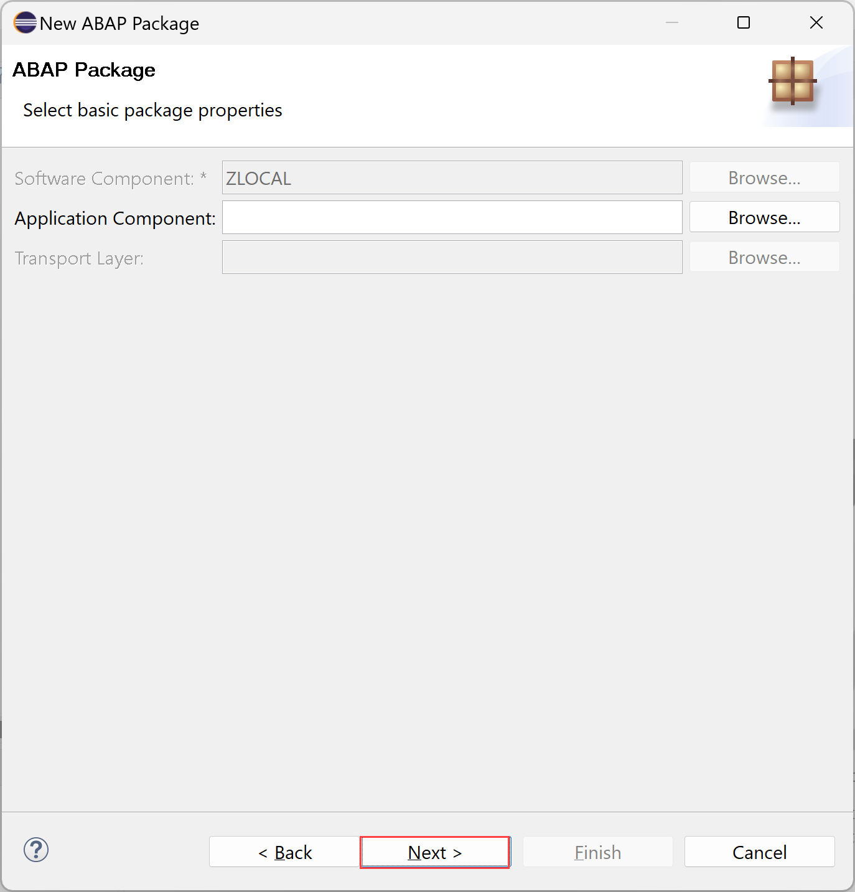 -->
      


  4.  Create a new request:
      -  Request Description: TR12345

      <!-- 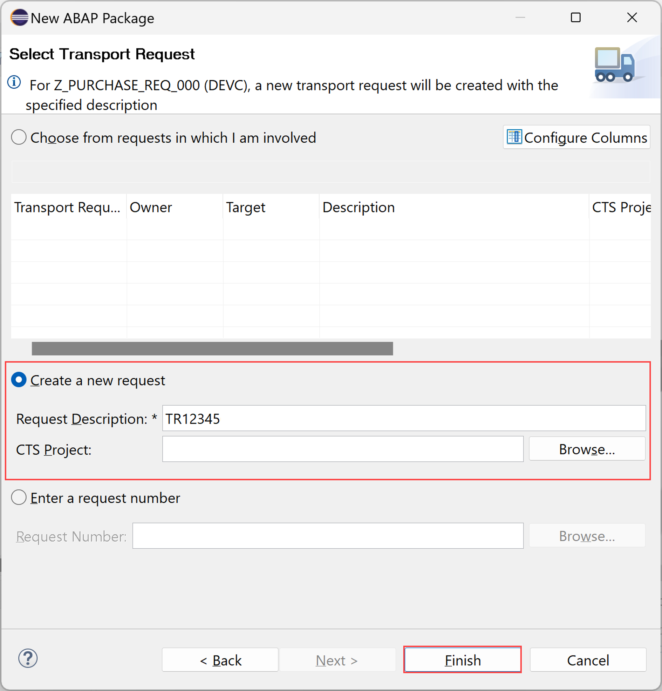 -->
      

       Click **Finish**.
</details>

## Step 2: Create database table

We start the creation of the RAP business object with creating a database table.   

<details>
  <summary>🔵 Click to expand</summary>

  1. Right-click your package `Z_PURCHASE_REQ_###` and select **New** > **Other ABAP Repository Object**.

      <!-- 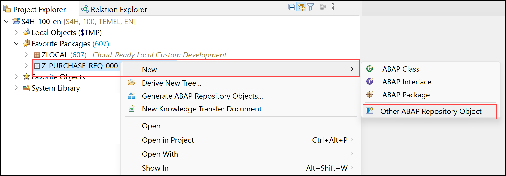 -->
      

  2. Search for **database table**, select it and click **Next >**.

      <!-- 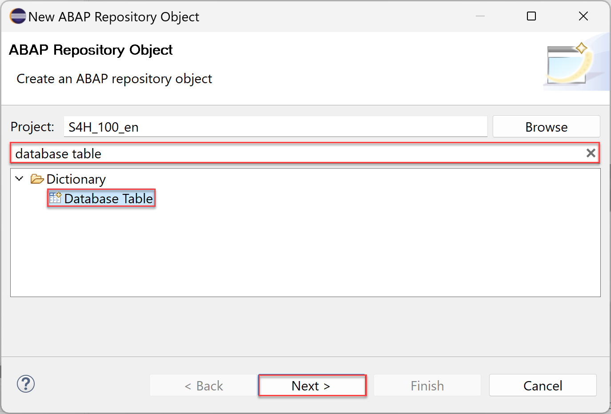 -->
      

  3. Create new database table:
     - Name: `ZASHOPCART_### `
     - Description: Shopping cart table

      <!-- 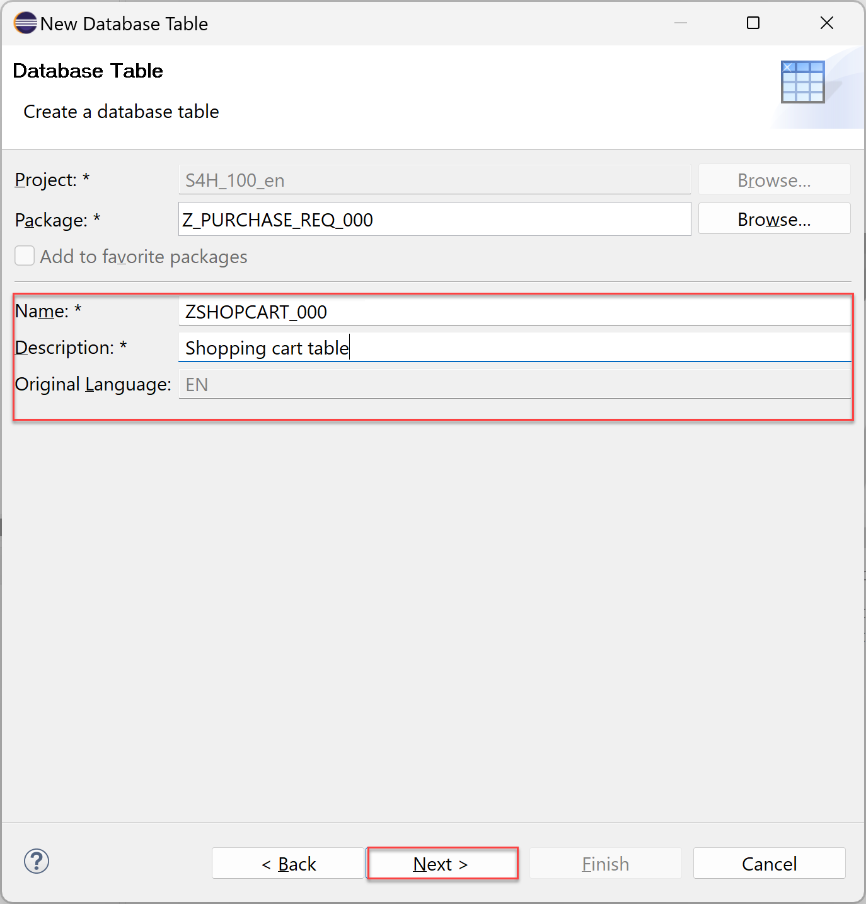 -->
      

       Click **Next >**.

  4. Click **Finish**.

      <!--  -->
      

  5. Replace your code with following:
   
   ```
    @EndUserText.label : 'Shopping cart table'
    @AbapCatalog.enhancement.category : #NOT_EXTENSIBLE
    @AbapCatalog.tableCategory : #TRANSPARENT
    @AbapCatalog.deliveryClass : #A
    @AbapCatalog.dataMaintenance : #RESTRICTED
    define table zashopcart_### {
    key client            : abap.clnt not null;
    key order_uuid        : sysuuid_x16 not null;
    order_id              : abap.numc(8) not null;
    ordered_item          : abap.char(40) not null;
    @Semantics.amount.currencyCode : 'zashopcart_###.currency'
    price                 : abap.curr(11,2);
    @Semantics.amount.currencyCode : 'zashopcart_###.currency'
    total_price           : abap.curr(11,2);
    currency              : abap.cuky;
    order_quantity        : abap.numc(4);
    delivery_date         : abap.dats;
    overall_status        : abap.char(30);
    notes                 : abap.string(256);
    created_by            : abp_creation_user;
    created_at            : abp_creation_tstmpl;
    last_changed_by       : abp_lastchange_user;
    last_changed_at       : abp_lastchange_tstmpl;
    local_last_changed_at : abp_locinst_lastchange_tstmpl;
    purchase_requisition  : abap.char(10);
    pr_creation_date      : abap.dats;
    }
   ```
   
   6. Save and activate.

</details>

## Step 3: Generate a transactional UI service

You will now use a wizard to generate all repository objects required for your RAP business object based on the table you have just created.  

 <details>
  <summary>🔵 Click to expand</summary>


  1. Right-click your database table `ZASHOPCART_###` and select **Generate ABAP Repository Objects**.

      <!--  -->
      

  2. Create new **ABAP repository object**:
     - Generator: **ABAP RESTful Application Programming Model: UI Service**

      <!-- 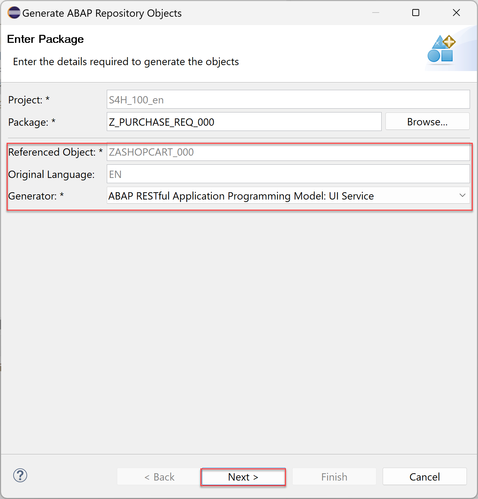 -->
      

       Click **Next >**.

      > Please be aware that the screenshot above pertains to the SAP S/4HANA 2022 release. In the SAP S/4HANA 2023 release the wizard looks slightly different: you will first select the **Generator** and in the following wizard page you will see the Package information.

  3. Maintain the required information on the **Configure Generator** dialog to provide the name of your data model and generate them.         
     
     For that, navigate through the wizard tree **(Business Objects, Data Model, etc...)**, maintain the artefact names provided in the table below, and press **Next >**.

     Verify the maintained entries and press **Next >** to confirm. The needed artifacts will be generated.

     **Please note**: Error Invalid XML format.   
     If you receive an error message **Invalid XML format of the response**, this may be due to a bug in version 1.26 of the ADT tools. An update of your ADT plugin to version 1.26.3 will fix this issue.

   | **RAP Layer**                          | **Artefacts**           | **Artefact Names**                                  |
   |----------------------------------------|-------------------------|-----------------------------------------------------|
   | **Business Object**                    |                         |                                                     |
   |                                        | **Data Model**          | Data Definition Name: **`ZR_SHOPCARTTP_###`**     |
   |                                        |                         | Alias Name: **`ShoppingCart`**                        |  
   |                                        | **Behavior**            | Implementation Class: **`ZBP_SHOPCARTTP_###`**    |
   |                                        |                         | Draft Table Name: **`ZDSHOPCART_###`**            |  
   | **Service Projection (BO Projection)** |                         | Name: **`ZC_SHOPCARTTP_###`**                     |
   | **Business Services**                  |                         |                                                     |
   |                                        | **Service Definition**  | Name: **`ZUI_SHOPCART_###`**                      |
   |                                        | **Service Binding**     | Name: **`ZUI_SHOPCART_O4_###`**                   |
   |                                        |                         | Binding Type: **`OData V4 - UI`**                   |

<!-- 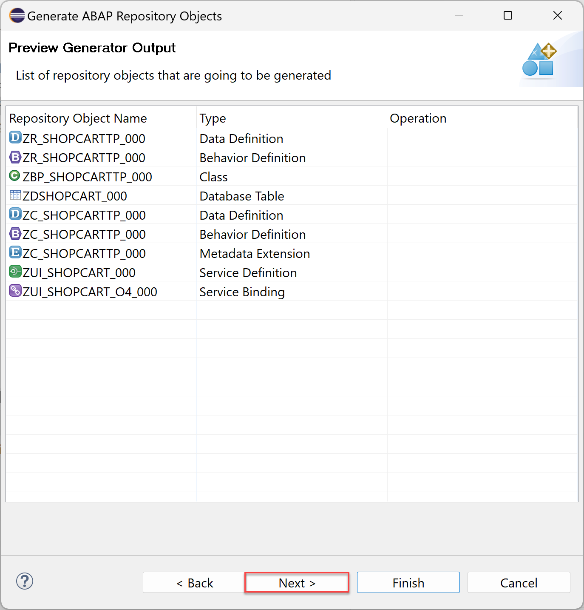 -->


   Click **Next >**.

  4. Click **Finish**.

<!-- 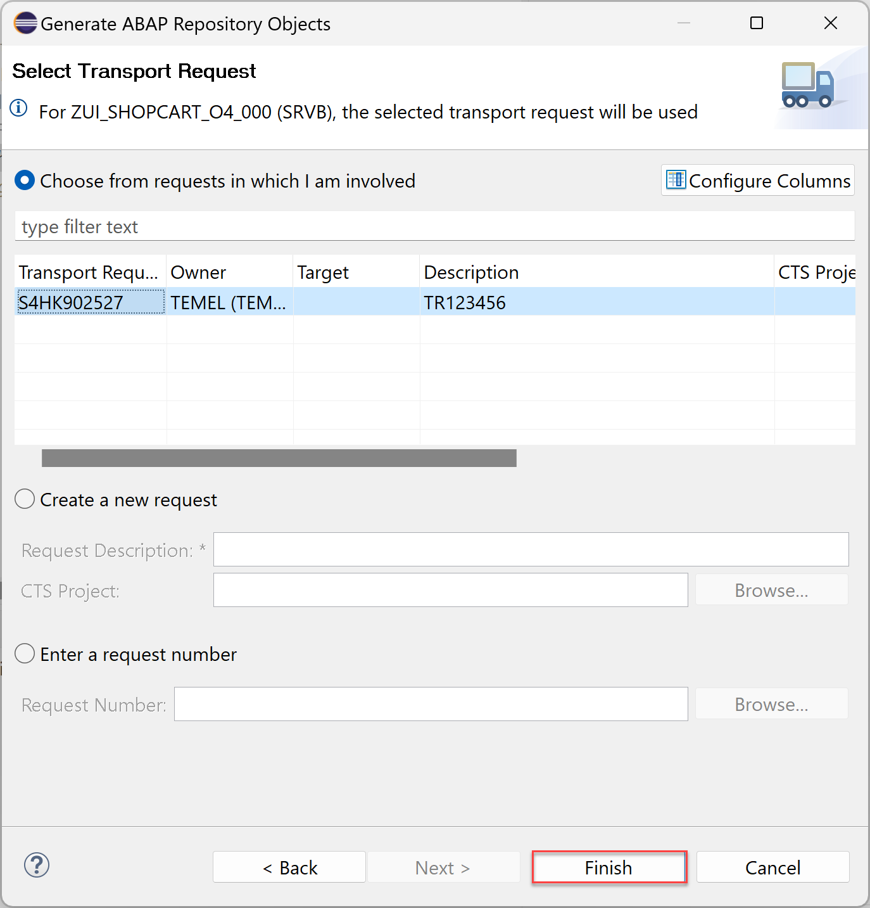 -->


</details>

## Step 4: Adapt the behavior definition of data model 

The generated code has to be adapted so that additional fields are made _read-only_.   

 <details>
  <summary>🔵 Click to expand</summary>
  
  1. Open your behavior definition **`ZR_SHOPCARTTP_###`** to enhance it. Add the following read-only fields to your behavior definition:

   ```
    ,   
    PurchaseRequisition,   
    PrCreationDate,   
    OverallStatus;   
   ```
   
   <!-- 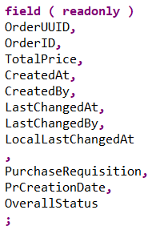 -->
   

  2. Check your behavior definition:

<details>
  <summary>🟡📄 Click to expand and view and compare the source code!</summary>

   ```
    managed implementation in class ZBP_SHOPCARTTP_### unique;
    strict ( 2 );
    with draft;

    define behavior for ZR_SHOPCARTTP_### alias ShoppingCart
    persistent table zashopcart_###
    draft table ZDSHOPCART_###
    etag master LocalLastChangedAt
    lock master total etag LastChangedAt
    authorization master( global )

    {
    field ( readonly )
       OrderUUID,
       CreatedAt,
       CreatedBy,
       LastChangedAt,
       LastChangedBy,
       LocalLastChangedAt,
       PurchaseRequisition,
       PrCreationDate,
       OverallStatus;

    field ( numbering : managed )
       OrderUUID;


    create;
    update;
    delete;

    draft action Edit;
    draft action Activate;
    draft action Discard;
    draft action Resume;
    draft determine action Prepare;

    mapping for ZASHOPCART_###
    {
       OrderUUID = ORDER_UUID;
       OrderID = ORDER_ID;
       OrderedItem = ORDERED_ITEM;
       Price = PRICE;
       TotalPrice = TOTAL_PRICE;
       Currency = CURRENCY;
       OrderQuantity = ORDER_QUANTITY;
       DeliveryDate = DELIVERY_DATE;
       OverallStatus = OVERALL_STATUS;
       Notes = NOTES;
       CreatedBy = CREATED_BY;
       CreatedAt = CREATED_AT;
       LastChangedBy = LAST_CHANGED_BY;
       LastChangedAt = LAST_CHANGED_AT;
       LocalLastChangedAt = LOCAL_LAST_CHANGED_AT;
       PurchaseRequisition = PURCHASE_REQUISITION;
       PrCreationDate = PR_CREATION_DATE;
    }
    }    
   ```

</details>

   3. Save and activate.  
</details>

## Step 5: Publish service binding and run SAP Fiori Elements preview

What is left to do is to publish your service locally, so that it can be tested using the Fiori Elements preview.  

 <details>
  <summary>🔵 Click to expand</summary>
 
 
  1. Open your service binding **`ZUI_SHOPCART_O4_###`** and click **Publish**.

     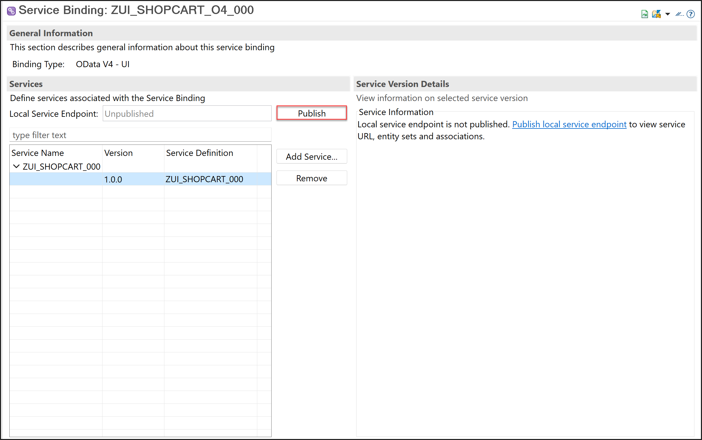
     

  2. Select **`ShoppingCart`** in your service binding and click **Preview** to open SAP Fiori Elements preview.

     
     

</details>

## Summary & Next Exercise
[^Top of page](#)

Now that you've... 
- created an ABAP package on tier 1 (superpackage: `ZLOCAL`),
- created a database table to store the shopping cart data,
- generated a RAP BO and a transactional UI service,
- enhanced the behavior definition of a data model,
- published the service binding, and 
- ran the SAP Fiori Elements App Preview,

you can continue with the next exercise - **[Exercise 3 - Create Value Help, Enhance the Behavior Definition and Behavior Implementation of the Shopping Cart Business Object](../ex3/README.md)**.

---

