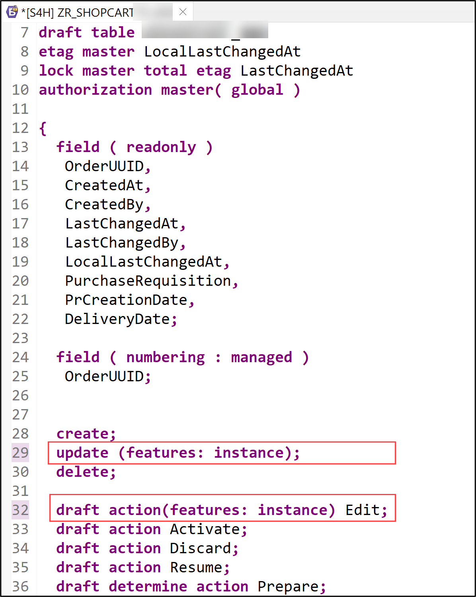
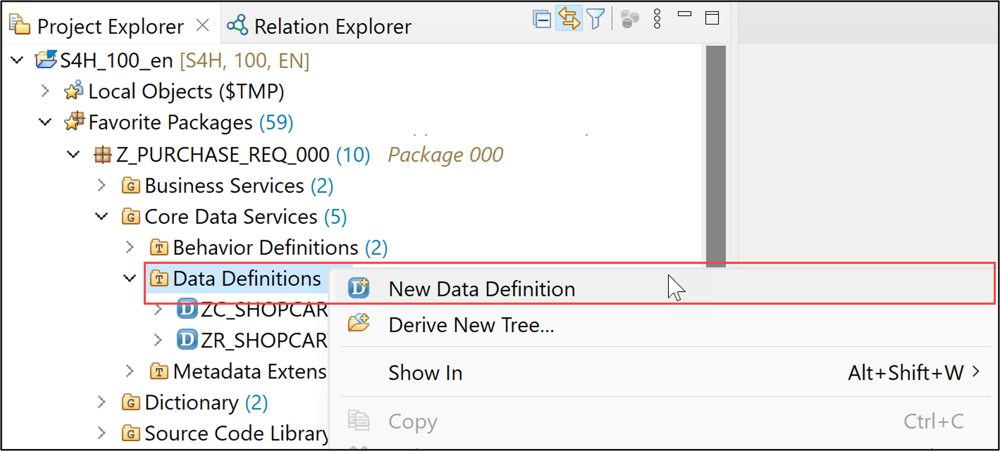
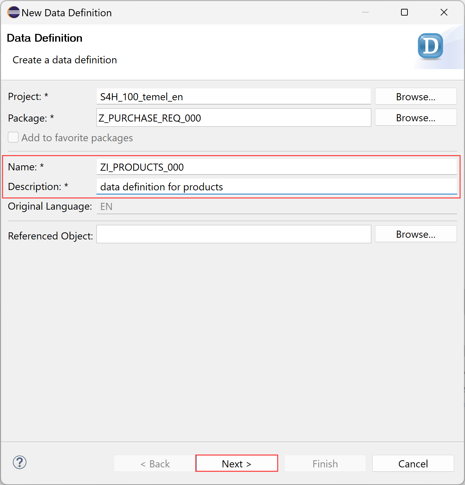
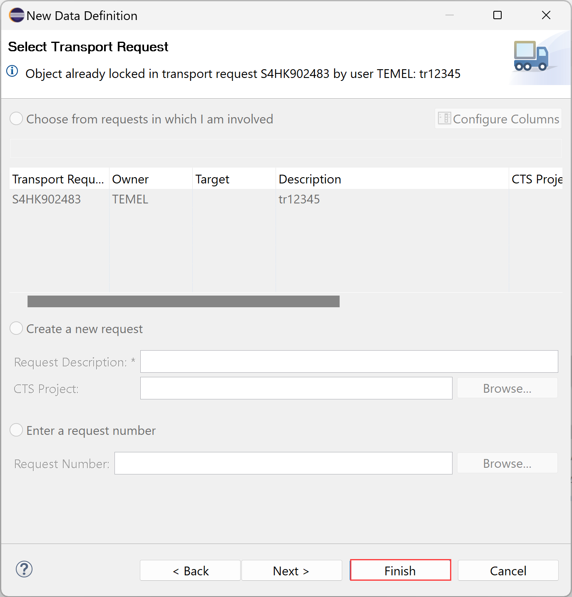
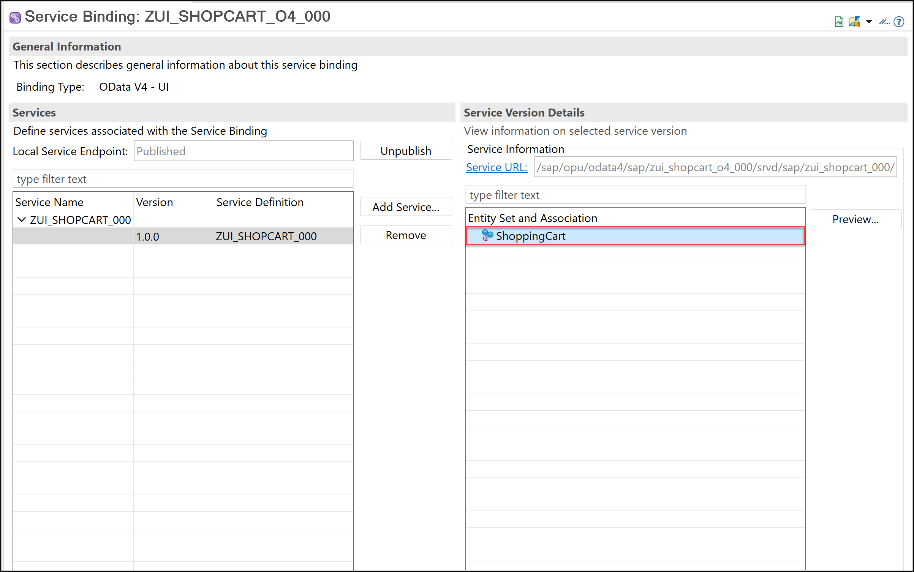
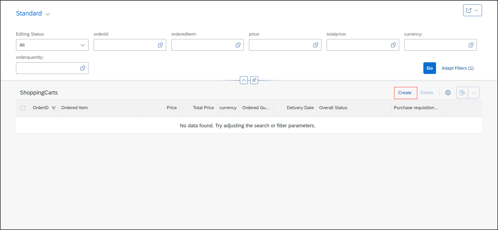
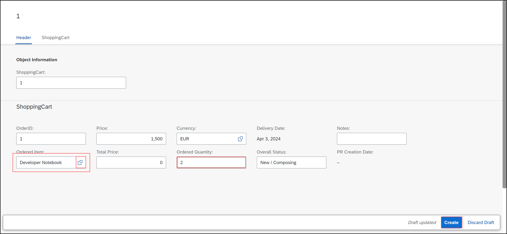
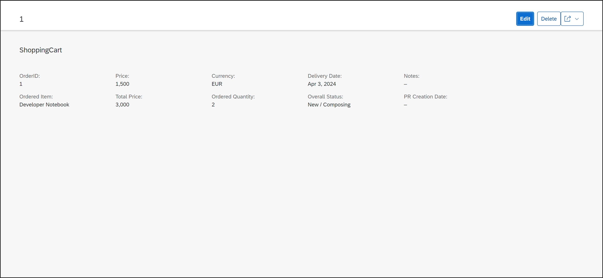

# Exercise 3: Create Value Help, Enhance the Behavior Definition and Behavior Implementation of the Shopping Cart Business Object
<!-- description --> Create your first order in the shopping cart.

## Introduction

Now that you've created your Shopping Cart RAP business object and a UI service on top in [exercise 2](../ex2/README.md), you will enhance the RAP BO data model, behavior definition, and behavior implementation in the present exercise. 

- [You will learn](#you-will-learn)
- [Summary & Next Exercise](#summary--next-exercise)  

## You will learn  
- How to enhance a behavior definition to add validations, determinations and side effects   
- How to create a value help   
- How to enhance a behavior implementation  
- How to run the SAP Fiori Elements Preview  

> **Reminder:**   
> Don't forget to replace all occurences of the placeholder **`###`** with your assigned group number in the exercise steps below.  
> You can use the ADT function **Replace All** (**Ctrl+F**) for the purpose.   
> If you don't have a group number, choose a 3-digit suffix and use it for all exercises.

---

## Step 1: Enhance behavior definition to add validations, determinations and side effects

In this step we will add validations, determinations and side effects.   

<details>
  <summary>🔵 Click to expand</summary>
  
  1. Open your behavior definition **`ZR_SHOPCARTTP_###`** to enhance it. Add the following statements to your behavior definition:

      ```   
      update (features: instance);    
      ```   

     and    
    
      ``` 
      draft action(features: instance) Edit;   
      ```

      

<!---->


  2. Replace the statement

     `draft determine action Prepare;` 
   
     in your behavior definition with the following code:   

        ``` 
        draft determine action Prepare { validation checkOrderedQuantity;  validation checkDeliveryDate;}
        determination setInitialOrderValues on modify { create; }
        determination calculateTotalPrice on modify { create; field Price; } 
        validation checkOrderedQuantity on save { create; field OrderQuantity; }
        validation checkDeliveryDate on save { create; field DeliveryDate; }
        ```
   
<!-- -->


  3. Add side effects to update the field **TotalPrice**.   

     Add this code-snippet before the `mapping` statement.    

     ``` 
      //  side effects
      side effects
      {
        field Price affects field TotalPrice;
        field OrderQuantity affects field TotalPrice;
      }   
      ```

 
  4. Check your behavior definition:


     <details>
      <summary>🟡📄 Click to expand and view or copy the source code!</summary>    
  
      ```
      
      managed implementation in class ZBP_SHOPCARTTP_### unique;
      strict ( 2 );
      with draft;

      define behavior for ZR_SHOPCARTTP_### alias ShoppingCart
      persistent table zashopcart_###
      draft table ZDSHOPCART_###
      etag master LocalLastChangedAt
      lock master total etag LastChangedAt
      authorization master( global )
      {
      field ( readonly ) 
      OrderUUID,
      CreatedAt,
      CreatedBy,
      LastChangedAt,
      LastChangedBy,
      LocalLastChangedAt,
      PurchaseRequisition,
      PrCreationDate,
      OverallStatus;

      field ( numbering : managed )
      OrderUUID;

      create;
      update(features: instance) ;
      delete;

      draft action(features: instance) Edit;
      draft action Activate;
      draft action Discard; 
      draft action Resume;
      draft determine action Prepare { validation checkOrderedQuantity;  validation checkDeliveryDate;}
        determination setInitialOrderValues on modify { create; }
        determination calculateTotalPrice on modify { create; field Price; }
      validation checkOrderedQuantity on save { create; field OrderQuantity; }
      validation checkDeliveryDate on save { create; field DeliveryDate; }


      //  side effects
      side effects
      {
        field Price affects field TotalPrice;
        field OrderQuantity affects field TotalPrice;
      }   

 
      mapping for ZASHOPCART_### 
      {
        OrderUUID = order_uuid;
        OrderID = order_id;
        OrderedItem = ordered_item;
        Price = price;
        TotalPrice = total_price;
        Currency = currency;
        OrderQuantity = order_quantity;
        DeliveryDate = delivery_date;
        OverallStatus = overall_status;
        Notes = notes;
        CreatedBy = created_by;
        CreatedAt = created_at;
        LastChangedBy = last_changed_by;
        LastChangedAt = last_changed_at;
        LocalLastChangedAt = local_last_changed_at;
        PurchaseRequisition = purchase_requisition;
        PrCreationDate = pr_creation_date;
      }
      }
      **Hint:** Please replace **`###`** with your ID.
      
      ```
</details>
    
   4. Save and activate. 

</details>

## Step 2: Activate use of side effects in the behavior projection

In this step will activate the use of side effects so that the field **TotalPrice** will be updated immediately once the price or the number of ordered items has been changed.   

<details>
  <summary>🔵 Click to expand</summary>

  1. Open your behavior definition **`ZC_SHOPCARTTP_###`** to enhance it. Add the following statements to your behavior projection:

      ```   
      use side effects;      
      ```   

  2. Check your behavior projection:

     <details>
      <summary>🟡📄 Click to expand and view or copy the source code!</summary>
  
       ```
       projection;
       strict ( 2 );
       use draft;
       use side effects;

       define behavior for ZC_SHOPCARTTP_### alias ShoppingCart
       use etag


       {
         use create;
         use update;
         use delete;

         use action Edit;
         use action Activate;
         use action Discard;
         use action Resume;
         use action Prepare;
 
       }

       ```
     </details>   
    
</details>   

## Step 3: Create data definition for products

This data definition is needed to create a value help for products.

<details>
  <summary>🔵 Click to expand</summary>

 1. Right-click **Data Definitions** and select **New Data Definition**.
  
    <!--  -->
    


 2. Create a new data definition:
    - Name: `ZI_Products_###`
    - Description: `data definition for products`
  
      Click **Next >**.

      <!--  -->
      
  
 3. Click **Finish**.  
   
      <!-- -->
      

 4. In your data definition **`ZI_Products_###`** replace your code with following:

<details>
  <summary>🟡📄 Click to expand and view or copy the source code!</summary>
  
   ```
    @AbapCatalog.viewEnhancementCategory: [#NONE]
    @AccessControl.authorizationCheck: #NOT_REQUIRED
    @EndUserText.label: 'Value Help for I_PRODUCT'
    @Metadata.ignorePropagatedAnnotations: true
    @ObjectModel.usageType:{
      serviceQuality: #X,
      sizeCategory: #S,
      dataClass: #MIXED
    }
    define view entity ZI_PRODUCTS_###
      as select from I_Product
    {
      key Product                                                 as Product,
          _Text[1: Language=$session.system_language].ProductName as ProductText,
          @Semantics.amount.currencyCode: 'Currency'
          case
            when Product = 'D001' then cast ( 1000.00 as abap.dec(16,2) ) 
            when Product = 'D002' then cast ( 499.00 as abap.dec(16,2) ) 
            when Product = 'D003' then cast ( 799.00 as abap.dec(16,2) ) 
            when Product = 'D004' then cast ( 249.00 as abap.dec(16,2) )
            when Product = 'D005' then cast ( 1500.00 as abap.dec(16,2) ) 
            when Product = 'D006' then cast ( 30.00 as abap.dec(16,2) ) 
            else cast ( 100000.00 as abap.dec(16,2) ) 
          end                                                     as Price,
          
          @UI.hidden: true
          cast ( 'EUR' as abap.cuky( 5 ) )                        as Currency,

          @UI.hidden: true
          ProductGroup                                            as ProductGroup,

          @UI.hidden: true
          BaseUnit                                                as BaseUnit

    }
    where
        Product = 'D001'
      or Product = 'D002'
      or Product = 'D003'
      or Product = 'D004'
      or Product = 'D005'
      or Product = 'D006'
   ```

</details>
    
 5. Save and activate.

 6. You can test your CDS view entity by pressing F8 to start the _Data Preview_.   

</details>

## Step 4: Enhance metadata extension

You will now adjust the UI semantics of your Fiori elements app by enhancing the CDS metadata extension `ZC_SHOPCARTTP_###`.

<details>
  <summary>🔵 Click to expand</summary>
  
 1. In your metadata extension **`ZC_SHOPCARTTP_###`** replace your code with following:

  <details>
    <summary>🟡📄 Click to expand and view or copy the source code!</summary> 
  
   ```ABAP
    @Metadata.layer: #CORE
    @UI: {
      headerInfo: {
        typeName: 'ShoppingCart', 
        typeNamePlural: 'ShoppingCarts'
      , title: {
          type: #STANDARD,
          label: 'ShoppingCart',
          value: 'orderid'
        }
      },
      presentationVariant: [ {
        sortOrder: [ {
          by: 'OrderID',
          direction: #DESC
        } ],
        visualizations: [ {
          type: #AS_LINEITEM
        } ]
      } ]
    }
    annotate view ZC_SHOPCARTTP_### with
    {
      @UI.facet: [ {
        id: 'idIdentification', 
        type: #IDENTIFICATION_REFERENCE, 
        label: 'ShoppingCart', 
        position: 10 
      } ]
      @UI.hidden: true
      OrderUUID;
      
      @UI.lineItem: [ {
        position: 10 , 
        importance: #MEDIUM, 
        label: 'OrderID'
      } ]
      @UI.identification: [ {
        position: 10 , 
        label: 'OrderID'
      } ]
      OrderID;
      
      @UI.lineItem: [ {
        position: 20 , 
        importance: #MEDIUM, 
        label: 'OrderedItem'
      } ]
      @UI.identification: [ {
        position: 20 , 
        label: 'OrderedItem'
      } ]
      @Consumption.valueHelpDefinition: [{ entity: 
                    {name: 'ZI_PRODUCTS_###' , element: 'ProductText' },
                    additionalBinding: [{ localElement: 'Price', element: 'Price', usage: #RESULT },
                                        { localElement: 'Currency', element: 'Currency', usage: #RESULT }
                                                                          ]
                    }]  
      OrderedItem;
      
      @UI.lineItem: [ {
        position: 30 , 
        importance: #MEDIUM, 
        label: 'Price'
      } ]
      @UI.identification: [ {
        position: 30 , 
        label: 'Price'
      } ]
      Price;
      
      @UI.lineItem: [ {
        position: 40 , 
        importance: #MEDIUM, 
        label: 'TotalPrice'
      } ]
      @UI.identification: [ {
        position: 40 , 
        label: 'TotalPrice'
      } ]
      TotalPrice;
      
      @UI.lineItem: [ {
        position: 50 , 
        importance: #MEDIUM, 
        label: 'Currency'
      } ]
      @UI.identification: [ {
        position: 50 , 
        label: 'Currency'
      } ]
      @Consumption.valueHelpDefinition: [ { entity: { name: 'I_Currency', element: 'Currency' } } ]  
      Currency;
      
      @UI.lineItem: [ {
        position: 60 , 
        importance: #MEDIUM, 
        label: 'OrderQuantity'
      } ]
      @UI.identification: [ {
        position: 60 , 
        label: 'OrderQuantity'
      } ]
      OrderQuantity;
      
      @UI.lineItem: [ {
        position: 70 , 
        importance: #MEDIUM, 
        label: 'DeliveryDate'
      } ]
      @UI.identification: [ {
        position: 70 , 
        label: 'DeliveryDate'
      } ]
      DeliveryDate;
      
      @UI.lineItem: [ {
        position: 80 , 
        importance: #MEDIUM, 
        label: 'OverallStatus'
      } ]
      @UI.identification: [ {
        position: 80 , 
        label: 'OverallStatus'
      } ]
      OverallStatus;
      
      @UI.lineItem: [ {
        position: 90 , 
        importance: #MEDIUM, 
        label: 'Notes'
      } ]
      @UI.identification: [ {
        position: 90 , 
        label: 'Notes'
      } ]
      Notes;
      
      @UI.hidden: true
      LocalLastChangedAt;
      
      @UI.lineItem: [ {
        position: 100 , 
        importance: #MEDIUM, 
        label: 'PurchaseRequisition'
      },
      { type: #FOR_ACTION, dataAction: 'createPurchRqnBAPISave', label: 'Create PR via BAPI in SAVE' } ]
      @UI.identification: [ {
        position: 100 , 
        label: 'PurchaseRequisition'
      }, { type: #FOR_ACTION, dataAction: 'createPurchRqnBAPISave', label: 'Create PR via BAPI in SAVE' }  ]
      PurchaseRequisition;
      
      @UI.lineItem: [ {
        position: 110 , 
        importance: #MEDIUM, 
        label: 'PrCreationDate'
      } ]
      @UI.identification: [ {
        position: 110 , 
        label: 'PrCreationDate'
      } ]
      PrCreationDate;
    }
   ```
  </details>
    
 2. Save and activate.

   </details>
   
## Step 5: Enhance behavior implementation

Enhance the BO behavior implementation according to the enhancements done in the BO behavior definition.

<details>
  <summary>🔵 Click to expand</summary>

1. Open the behavior implementation **`ZBP_SHOPCARTTP_###`**, add the constant `c_overall_status` to your behavior implementation. In your **Local Types**, replace your code with following:
  
   Do not forget to replace all occurences of the placeholder **`###`** with your suffix. 
 
  <details>
    <summary>🟡📄 Click to expand and view or copy the source code!</summary>

   ```ABAP
    CLASS lhc_shopcart DEFINITION INHERITING FROM cl_abap_behavior_handler.
      PRIVATE SECTION.
        CONSTANTS:
          BEGIN OF c_overall_status,
            new       TYPE string VALUE 'New / Composing',
            submitted TYPE string VALUE 'Submitted / Approved',
            cancelled TYPE string VALUE 'Cancelled',
          END OF c_overall_status.
        METHODS:
          get_global_authorizations FOR GLOBAL AUTHORIZATION
            IMPORTING
            REQUEST requested_authorizations FOR ShoppingCart
            RESULT result,
          get_instance_features FOR INSTANCE FEATURES
            IMPORTING keys REQUEST requested_features FOR ShoppingCart RESULT result.

        METHODS calculateTotalPrice FOR DETERMINE ON MODIFY
          IMPORTING keys FOR ShoppingCart~calculateTotalPrice.

        METHODS setInitialOrderValues FOR DETERMINE ON MODIFY
          IMPORTING keys FOR ShoppingCart~setInitialOrderValues.

        METHODS checkDeliveryDate FOR VALIDATE ON SAVE
          IMPORTING keys FOR ShoppingCart~checkDeliveryDate.

        METHODS checkOrderedQuantity FOR VALIDATE ON SAVE
          IMPORTING keys FOR ShoppingCart~checkOrderedQuantity.
    ENDCLASS.

    CLASS lhc_shopcart IMPLEMENTATION.
      METHOD get_global_authorizations.
      ENDMETHOD.
      METHOD get_instance_features.

        " read relevant olineShop instance data
        READ ENTITIES OF zr_shopcarttp_### IN LOCAL MODE
          ENTITY ShoppingCart
            FIELDS ( OverallStatus )
            WITH CORRESPONDING #( keys )
          RESULT DATA(OnlineOrders)
          FAILED failed.

        " evaluate condition, set operation state, and set result parameter
        " update and checkout shall not be allowed as soon as purchase requisition has been created
        result = VALUE #( FOR OnlineOrder IN OnlineOrders
                          ( %tky                   = OnlineOrder-%tky
                            %features-%update
                              = COND #( WHEN OnlineOrder-OverallStatus = c_overall_status-submitted  THEN if_abap_behv=>fc-o-disabled
                                        WHEN OnlineOrder-OverallStatus = c_overall_status-cancelled THEN if_abap_behv=>fc-o-disabled
                                        ELSE if_abap_behv=>fc-o-enabled   )
                            %action-Edit
                              = COND #( WHEN OnlineOrder-OverallStatus = c_overall_status-submitted THEN if_abap_behv=>fc-o-disabled
                                        WHEN OnlineOrder-OverallStatus = c_overall_status-cancelled THEN if_abap_behv=>fc-o-disabled
                                        ELSE if_abap_behv=>fc-o-enabled   )

                            ) ).
      ENDMETHOD.

      METHOD calculateTotalPrice.
        DATA total_price TYPE zr_shopcarttp_###-TotalPrice.

        " read transfered instances
        READ ENTITIES OF zr_shopcarttp_### IN LOCAL MODE
          ENTITY ShoppingCart
            FIELDS ( OrderID TotalPrice )
            WITH CORRESPONDING #( keys )
          RESULT DATA(OnlineOrders).

        LOOP AT OnlineOrders ASSIGNING FIELD-SYMBOL(<OnlineOrder>).
          " calculate total value
          <OnlineOrder>-TotalPrice = <OnlineOrder>-Price * <OnlineOrder>-OrderQuantity.
        ENDLOOP.

        "update instances
        MODIFY ENTITIES OF zr_shopcarttp_### IN LOCAL MODE
          ENTITY ShoppingCart
            UPDATE FIELDS ( TotalPrice )
            WITH VALUE #( FOR OnlineOrder IN OnlineOrders (
                              %tky       = OnlineOrder-%tky
                              TotalPrice = <OnlineOrder>-TotalPrice
                            ) ).
      ENDMETHOD.

      METHOD setInitialOrderValues.

        DATA delivery_date TYPE I_PurchaseReqnItemTP-DeliveryDate.
        DATA(creation_date) = cl_abap_context_info=>get_system_date(  ).
        "set delivery date proposal
        delivery_date = cl_abap_context_info=>get_system_date(  ) + 14.
        "read transfered instances
        READ ENTITIES OF ZR_shopcarttp_### IN LOCAL MODE
          ENTITY ShoppingCart
            FIELDS ( OrderID OverallStatus  DeliveryDate )
            WITH CORRESPONDING #( keys )
          RESULT DATA(OnlineOrders).

        "delete entries with assigned order ID
        DELETE OnlineOrders WHERE OrderID IS NOT INITIAL.
        CHECK OnlineOrders IS NOT INITIAL.

        " **Dummy logic to determine order IDs**
        " get max order ID from the relevant active and draft table entries
        SELECT MAX( order_id ) FROM zashopcart_### INTO @DATA(max_order_id). "active table
        SELECT SINGLE FROM zdshopcart_### FIELDS MAX( orderid ) INTO @DATA(max_orderid_draft). "draft table
        IF max_orderid_draft > max_order_id.
          max_order_id = max_orderid_draft.
        ENDIF.

        "set initial values of new instances
        MODIFY ENTITIES OF ZR_SHOPCARTTP_### IN LOCAL MODE
          ENTITY ShoppingCart
            UPDATE FIELDS ( OrderID OverallStatus  DeliveryDate Price  )
            WITH VALUE #( FOR order IN OnlineOrders INDEX INTO i (
                              %tky          = order-%tky
                              OrderID       = max_order_id + i
                              OverallStatus = c_overall_status-new  "'New / Composing'
                              DeliveryDate  = delivery_date
                              CreatedAt     = creation_date
                            ) ).
        .
      ENDMETHOD.

      METHOD checkDeliveryDate.

   *   " read transfered instances
        READ ENTITIES OF zr_shopcarttp_### IN LOCAL MODE
          ENTITY ShoppingCart
            FIELDS ( DeliveryDate )
            WITH CORRESPONDING #( keys )
          RESULT DATA(OnlineOrders).

        DATA(creation_date) = cl_abap_context_info=>get_system_date(  ).

        "raise msg if delivery date is not ok
    LOOP AT OnlineOrders INTO DATA(online_order).
      APPEND VALUE #(  %tky           = Online_Order-%tky
                       %state_area    = 'VALIDATE_DELIVERYDATE'
                    ) TO reported-ShoppingCart.

      IF online_order-DeliveryDate IS INITIAL OR online_order-DeliveryDate = ' '.
        APPEND VALUE #( %tky = online_order-%tky ) TO failed-ShoppingCart.
        APPEND VALUE #( %tky         = online_order-%tky
                        %state_area   = 'VALIDATE_DELIVERYDATE'
                        %msg          = new_message_with_text(
                                severity = if_abap_behv_message=>severity-error
                                text     = 'Delivery Date cannot be initial' )
                        %element-deliverydate  = if_abap_behv=>mk-on
                      ) TO reported-ShoppingCart.

      ELSEIF  ( ( online_order-DeliveryDate ) - creation_date ) < 14.
        APPEND VALUE #(  %tky = online_order-%tky ) TO failed-ShoppingCart.
        APPEND VALUE #(  %tky          = online_order-%tky
                        %state_area   = 'VALIDATE_DELIVERYDATE'
                        %msg          = new_message_with_text(
                                severity = if_abap_behv_message=>severity-error
                                text     = 'Delivery Date should be atleast 14 days after the creation date'  )
                        %element-deliverydate  = if_abap_behv=>mk-on
                      ) TO reported-ShoppingCart.
      ENDIF.
    ENDLOOP.

      ENDMETHOD.

      METHOD checkOrderedQuantity.

        "read relevant order instance data
        READ ENTITIES OF zr_shopcarttp_### IN LOCAL MODE
        ENTITY ShoppingCart
        FIELDS ( OrderID OrderedItem OrderQuantity )
        WITH CORRESPONDING #( keys )
        RESULT DATA(OnlineOrders).

        "raise msg if 0 > qty <= 10
        LOOP AT OnlineOrders INTO DATA(OnlineOrder).
          APPEND VALUE #(  %tky           = OnlineOrder-%tky
                          %state_area    = 'VALIDATE_QUANTITY'
                        ) TO reported-ShoppingCart.

          IF OnlineOrder-OrderQuantity IS INITIAL OR OnlineOrder-OrderQuantity = ' '.
            APPEND VALUE #( %tky = OnlineOrder-%tky ) TO failed-ShoppingCart.
            APPEND VALUE #( %tky          = OnlineOrder-%tky
                            %state_area   = 'VALIDATE_QUANTITY'
                            %msg          = new_message_with_text(
                                    severity = if_abap_behv_message=>severity-error
                                    text     = 'Quantity cannot be empty' )
                            %element-orderquantity = if_abap_behv=>mk-on
                          ) TO reported-ShoppingCart.

          ELSEIF OnlineOrder-OrderQuantity > 10.
            APPEND VALUE #(  %tky = OnlineOrder-%tky ) TO failed-ShoppingCart.
            APPEND VALUE #(  %tky          = OnlineOrder-%tky
                            %state_area   = 'VALIDATE_QUANTITY'
                            %msg          = new_message_with_text(
                                    severity = if_abap_behv_message=>severity-error
                                    text     = 'Quantity should be below 10' )

                            %element-orderquantity  = if_abap_behv=>mk-on
                          ) TO reported-ShoppingCart.
          ENDIF.
        ENDLOOP.
      ENDMETHOD.
    ENDCLASS.
  ```
  </details>

2. Save and activate.

3. Go back to your behavior definition `ZR_SHOPCARTTP_###` and activate it again, if needed. 

</details>

## Step 6: Run SAP Fiori elements app preview and create first order
Test the enhance _Shopping Cart_ app.

<details>
  <summary>🔵 Click to expand</summary>
  
 1. Select **`ShoppingCart`** in your service binding and click **Preview** to open SAP Fiori elements preview.

     <!-- 
     

 2. Click **Create** to create a new entry.

     <!--  -->
     

 3. Make use of the value help for ordered item and select one. Add also the ordered quantity and click **Create**.

     <!--  -->
     

 4. Your order is now created and the total price is calculated automatically.

     <!--  -->
     

</details>

## Summary & Next Exercise
[^Top of page](#)

Now that you've... 
- enhanced the data model with a value help,
- enhanced the behavior definition,
- enhanced the behavior implementation, and
- ran the SAP Fiori elements app preview,

you can continue with the next exercise - **[Exercise 4 - Integrate the Wrapper into the Shopping Cart Business Object](../ex4/README.md)**.

---
